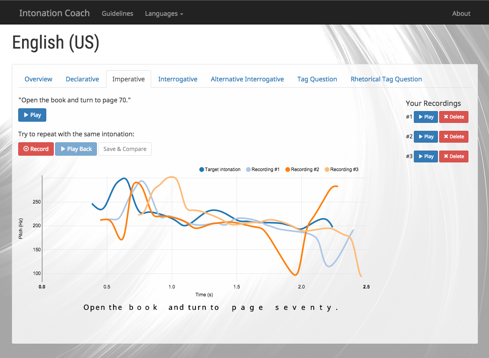
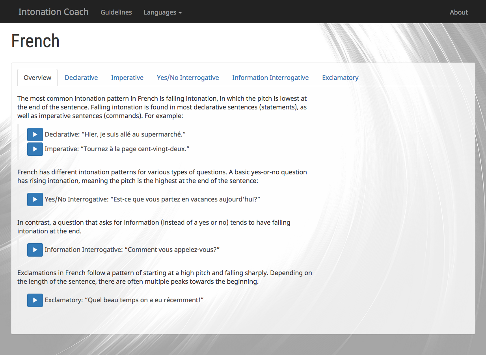
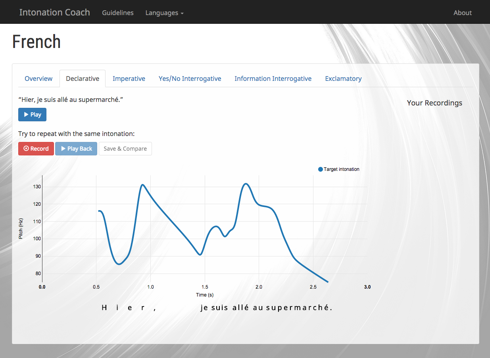
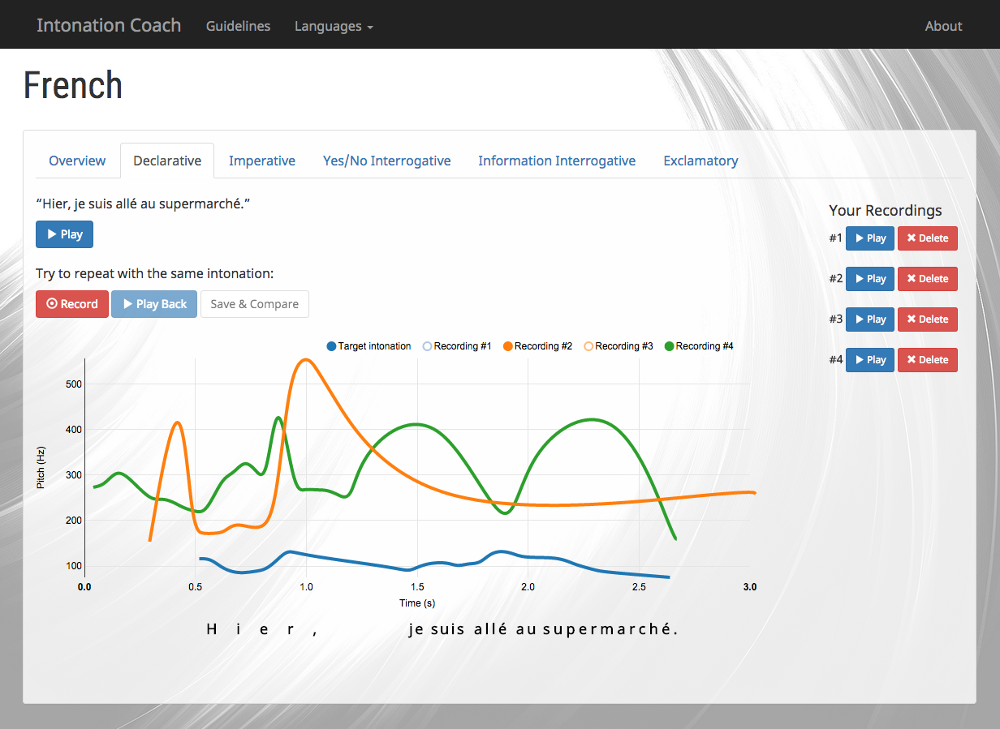

# Intonation Coach

Intonation, the variation in pitch in spoken language, is an important part of communication but is often one of the last pieces to be mastered in the process of learning a new language. Intonation Coach is a tool designed to help language learners practice and refine their intonation. A user can listen to an example sentence, record their attempt at repeating it, and then view a graphical comparison of pitch contours to see how their intonation measures up. By providing visual feedback and letting the user track their progress, this app helps language learners understand the melodies of language and improve the naturalness of their speech.

This app was built in 4.5 weeks during the Spring 2015 cohort of Hackbright Academy's Software Engineering Fellowship.

#### Technology Stack
Backend: Python, Flask, SQLAlchemy, SQLite  
Frontend: Javascript, jQuery, AJAX, HTML, CSS, Bootstrap, SVG  
APIs & Libraries: Web Audio API, [Recorder.js](https://github.com/mattdiamond/Recorderjs), Praat, [python-praat-scripts](https://github.com/mmcauliffe/python-praat-scripts), [NVD3](http://nvd3.org/), D3



## Using Intonation Coach

From the landing page, choose the language you want to practice. 


Read the overview tab and listen to each sample recording to learn about the intonation patterns you'll be practicing.



#### Recording & Analyzing

After reading the overview, click on a tab containing a sample sentence and listen to the example again there, observing the shape of the pitch contour in the graph as it plays. Whenever you're ready, hit "Record" and say the sentence out loud, trying to follow the same intonation pattern as the example. In order to get the most helpful results, try to speak at the same pace as the sample recording and use the moving bar as a guideline of which word you should be on.



After you've recorded, you can use the Play Back button to hear your recording, or you can go straight to the Save & Compare button to submit your attempt. Intonation Coach will then analyze your recording and add its pitch contour to the graph, where you can see how it compares to the target intonation.

You can continue to record and submit attempts as many times as you want; all pitch contours will be displayed simultaneously, and each recording will be catalogued on the right side of the page with a Play button and a Delete button. You can hide a recording from the graph by clicking on its name in the legend at the top right corner of the graph; if you want to discard a recording completely, press the Delete button for it on the right side of the page, and it will be erased and removed from the graph.



#### Evaluating Your Intonation

Since intonation is not an exact science and there's a lot of room for minor variations, Intonation Coach doesn't try to give you a quantitative score of how you did. Instead, it encourages you to self-evaluate by comparing the pitch contours on the graph. Generally, you want to aim for your pitch contour to have a similar overall shape to the target pitch contour, especially at the end of the sentence.

## Running Intonation Coach on Your Machine

Clone this repository: 

```
https://github.com/danafallon/IntonationCoach.git
```

Create and activate a virtual environment inside your project directory, then install the requirements:

```
virtualenv env  
source env/bin/activate  
pip install -r requirements.txt
```

This app also requires Praat, the phonetic analysis program used for pitch analysis. [Download Praat](http://www.fon.hum.uva.nl/praat/) and move it into your project directory. If you're using a Mac, you can stop there. For Windows or Linux, you will need to open pitchgraph.py and change 'Praat.app/Contents/MacOS/Praat' in line 10 to the appropriate path for the executable.

Then, run the server:

```
python server.py
```

Navigate to `localhost:5000` in your browser to start using Intonation Coach.